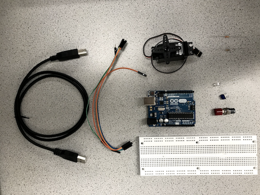

## LAB 1: Introduction to Micro-controllers

---

### Objective
In this introductory lab, we learned how to use the various functionalities of the Arduino Uno and the Arduino IDE. Our team constructed a simple functional Arduino program using multiple external components and the Arduino Uno. Once we mastered this basic understanding, we put together our robot and had it perform a simple autonomous task like turning in nearly 90-degree angles and as an
extra credit, following a black-taped line using a Line Follower
Sensor.

### Materials
  * Arduino IDE Software
  * 1 Arduino Uno
  * 1 USB A/B cable
  * 1 Continuous rotation servo
  * 1 Pushbutton
  * 1 LED (we chose a blue LED)
  * 1 Potentiometer
  * Several resistors (300Ω and kΩ range)
  * 1 Solderless breadboard

### Blinking an internal LED
The “Blink” example code was used to test the communication between the Arduino Uno and the IDE. At first, the code was compiled and uploaded without any modifications, and the on-board LED blinked on and off according to a certain value of delay.

### Blinking an external LED
To test the digital pins, an external blue LED was connected to digital **pin 13** in series with a 1k Ohm resistor. The external LED blinked on and off according to a certain value of delay.

### Reading the value of a potentiometer
To test the analog input pins, a **potentiometer** was connected to analog input **pin 0** in series with a 1k Ohm resistor to input different voltages. For data analysis, we used enabled the serial monitor to display the analog value every half second.

### Map the value of the potentiometer to the LED
Then the potentiometer was combined with the external LED circuit. The digital pin which the LED was connected to was set up as an PWM output pin. A square wave was generated to write analog voltages to the LED. This allowed the brightness of the LED to be adjusted with the potentiometer.

### Map the value of the potentiometer to the servo
During this stage, the white input signal wire on the parallax servo was connected to pin 9 so that it can read analog output generated by the potentiometer. The red wire was connected to 5V, and black wire was connected to GND. Example code Servo Knob was used in this part. The potentiometer values are scaled between 0 to 180 corresponding to servo speed. Value 0 and 180 represent full speed in opposite directions and 90 represents stop.

### Assemble your robot

### Driving your robot autonomously
As an extra-credit for Lab 1, our team included a Line Follower sensor that detected the existence of a black tape and knew the difference in color with respect to the white tiles on the floor. Using different sensors to manipulate the data acquired and programming our robot to react in a certain depending on the environment stimulation, is what actually makes it autonomous. On future labs, the team is planning on including different sensors like ultrasonic sensor for detecting the walls inside the maze, and maybe even position sensors to map the trajectory of the robot while solving the maze.

### Conclusions
