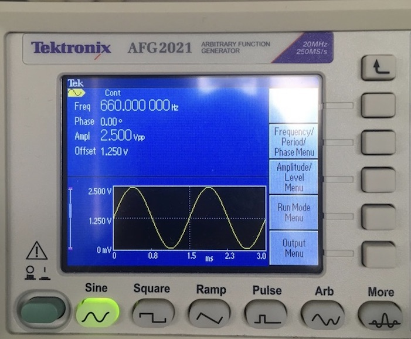

## LAB 2: Analog Circuitry and FFTs

### Objective

In this lab, we added different sensors to our robot, and made analog circuits
and a digital filter to interface with the Arduino. One is a microphone circuit
that detects a 660Hz whistle blow signifying the beginning of your maze mapping.
The other captures inputs from an IR sensor to detect an IR treasure blinking
at 7kHz.

## Acoustic Team

  

### Materials

  * Arduino Uno
  * Electret Microphone Amplifier - MAX4466 with Adjustable Gain
  * ~3 kΩ resistor

### Analysis of the microphone in the built-in system

When we started assembling our circuit, we made sure to test its different
components in order to make debugging easier in the future. The Electret Microphone was working perfectly according to the oscilloscope, since we could appreciate the difference in certain tones and noises. We obtained the following feedback after setting up an effective low-pass filter with a cut off frequency of 796 Hz using a 1µF capacitor and a ~200Ω resistor:

**Snapping video to be placed here**

For the purpose of the competition, we needed to amplify the signal since there is going to be a lot of background noise in Phillips Hall. We assembled a non-inverting amplifier with 10kΩ and 100kΩ, therefore having a gain of 10. However, we were not getting a signal at all, and the faculty even checked and validated our circuit before reaching any false conclusions. It was in fact a defectuous op amp, and many of the other teams were having the same issue. That is why we switched to a fully functional Electret Microphone Amplifier - MAX4466. This device already contained the desired analog filters, and an adjustable gain ranging from 4 to 26 -measured by our team using the function generator and the oscilloscope-:

* Peak-Peak Voltage at 660 Hz with microphone only: 200.0 mV
* Peak-Peak Voltage at 660 Hz with the built-in amplifier (MIN): 800 mV Amplifier gain: 4
* Peak-Peak Voltage at 660 Hz with the built-in amplifier (MAX): 5.28 V Amplifier gain: 26.4

From this lab, until the competition, we will work with such device to solve the acoustic challenges.

### Testing the Fast-Fourier-Transform algorithm provided by the Arduino

First of all, we started testing the function generator by hooking it up directly to the oscilloscope and make sure it was working properly. We tested it with a 660Hz frequency, 2.55Vpp amplitude, and 1.25V offset. Here is the feedback of the experiment:

Function Generator         |  Oscilloscope
:-------------------------:|:-------------------------:
  |    

With the function generator working properly, it was time to test the FFT algorithm provided by the Arduino Library `<FFT.h>`. Before assembling the circuit together, we had to do some work to figure out where our 660Hz frequency would fall inside the output from the FFT.

The ADC clock is set by the main clock speed of the Arduino, divided by a specific pre-scalar. The Arduino's clock frequency is 16MHz, and the pre-scalar set by the ADC inside the code `ADCSRA = 0xe5; // set the ADC to free running mode` is 32. If we divide 16MHz / 32, we obtain a clock frequency of 500KHz for the ADC. For it to convert an analog signal into a very precise digital signal of 10 bits, it takes 13 entire cycles. This would be 500KHz / 13 which yields a frequency of 38.4KHz. However, the ADC divides its reading into 256 separate points, which symbolize the range of values in each frequency bin. If we divide 38.4KHz / 256, we obtain 150Hz as our bin range. Therefore, each frequency bin contain values ranging from x to x + 150Hz. Our desired frequency to detect is 660Hz, which according to a simple division of 660Hz / 150Hz should appear in either bin 4 or bin 5. With the theoretical reasoning behind it, we tested the ADC using the function generator at different frequencies, all of them integer multiples of 660Hz in order to analyze precision and to check if there was an even space between the bins. This was our result:

And this is the data that we obtained from the graph regarding different bins and frequencies `(Frequency:Bin)` :

(660: 5), (1320: 10), (1980: 14), (2640: 19), (3300: 23), (3960: 27), (4620: 32), (5280: 36)

Our feedback was quite expected! We not only read the 660Hz in bin 5, but we could actually see the even spacing between the bins of the frequencies multiples of 660Hz -as it was expected, of course-. With that out of the way, we proceeded to actually test the circuit with our own 660Hz tone.

### Testing the circuit with a 660 Hz tone

### Conclusions

## IR Sensor Team

### Materials
